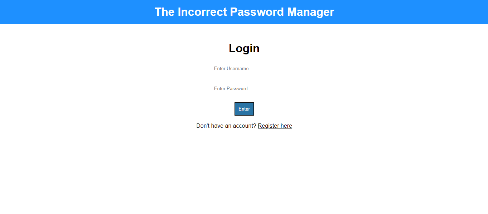
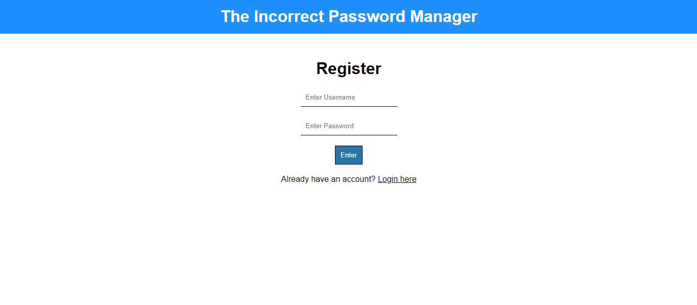
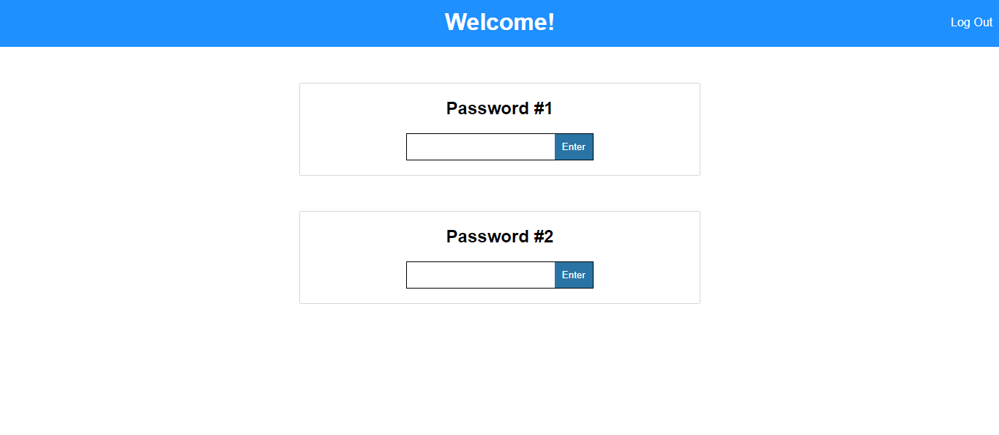
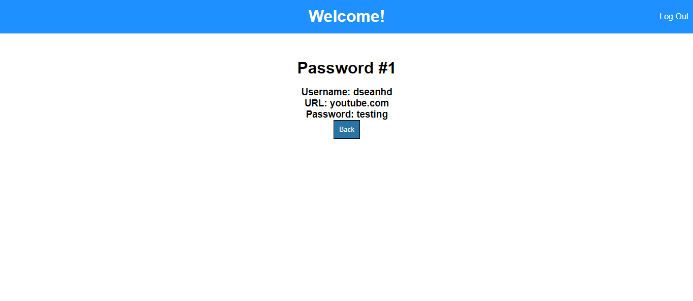

<h1>Incorrect Password Manager!</h1>

<h4><i>First things first, thank you for taking the time to check out my subsmission! I really appreciate it!</i></h4>

<h2>This project is called the Incorrect Password Manager and yes, you guessed it! 
It's a password manager but, it does not allow you in unless the password is <b>incorrect!</b></h2>

<h3><i>P.S. the password also has to be the same length as the one you registered with</i></h3>

<h1>How to use it</h1>

<h2>Since the app is just an HTML file, you can clone the repository and start using it or head to the link here: </h2>

<h1>Screenshots</h1>

<h3>Login page which would be your 'index.html' file</h3>

<h3>Register page</h3>

<h3>The page that stores the passwords</h3>

<h3>A page showing password information once the user enters the wrong password of the same length as the original</h3>

<h1>Demo Video</h1>
<h3>Here's the link to the Demo Video: <a target="_blank" href="https://youtu.be/kU8WbCqjlas">https://youtu.be/kU8WbCqjlas</a></h3>

 
<h1>Thanks for checking out my submission and shoutout to Lewis for organizing this!</h1>